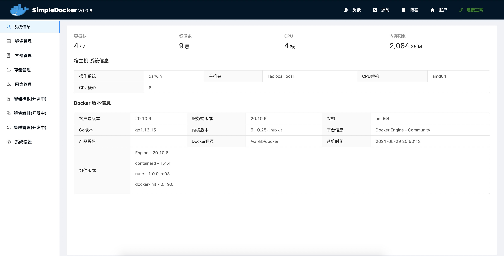
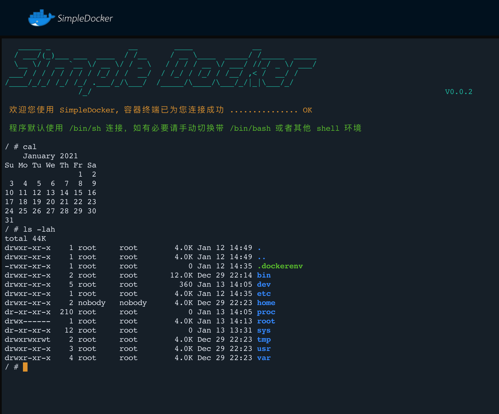
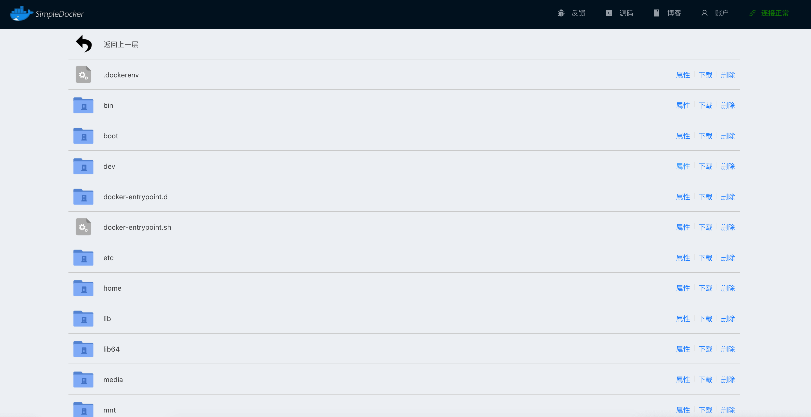
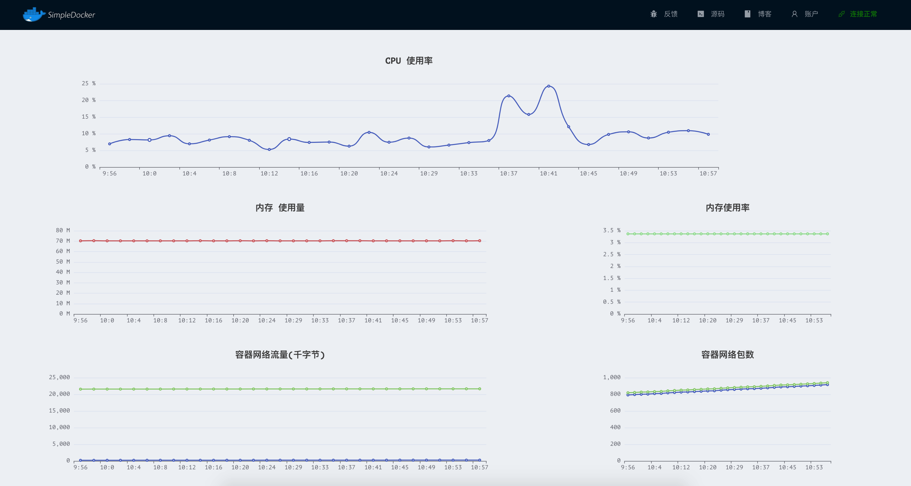

[](https://github.com/RichardLitt/standard-readme)


    


**SimpleDocker** 是一个简单的Docker控制面板，致力于可以让用户更方便、更无障碍、更舒适的使用Docker,其界面简洁、操作便捷，功能强大，可以带来更好地运维体验。

**个人开发维护不易，麻烦给个 Star ✨ 鼓励一下作者,您的鼓励是我最大的动力 😛！！！**

> 🎉 🔥 ✨ 新发布的 V0.0.6 新增容器备份到本地、查看容器Inspect的功能以及修复若干BUG


## 演示网站
   1. 演示环境 [http://docker.zhoutao123.com](http://docker.zhoutao123.com)
   2. 账号: admin 密码: 123456
   3. 演示环境，请勿删除/停止/暂停 simpledocker-xxxx 开头的容器，否则可能造成服务异常
   4. 如果演示环境无法登录或者无法使用，请及时创建Issue联系我


## 背景

Docker是目前一种非常主流的容器化方案，支持非常多的特性，给开发者带来便利，但是 Docker 镜像以及容器管理复杂的参数让新手望而却步，基于此开发 SimpleDocker 控制面板，方便新手和相关的运维同学使用!!!

> 本项目是基于学习的目的的，致力于提供一个 界面清晰、免费的、简单的、专注于 Docker 服务管理的控制面板(当然也会持续开发下去~)，目的只想做一个适合自己的管理软件！！！
> Tip: 您可以在Issues中提出需求和您发现的bug！[需求 & BUG 管理](https://github.com/taoes/SimpleDocker/issues)


### 🎉 目前支持特性

| 特性 | 支持功能                                               |
| ---- | ------------------------------------------------------ |
| 镜像 | 详情、拉取、运行、导出、导入、删除、备份到本地                     |
| 容器 | 详情、启动、停止、运行、暂停、删除、精简、导出、重命名、备份到本地 |
| 高级 | 终端、日志、文件管理、网络配置、异常通知               |
| 存储 | 管理、创建、删除、精简                                 |
| 网络 | 管理、创建、连接、精简                                 |
| 安全 | 登录、密码重置                                         |
| 设置 | 容器创建模式，容器异常通知配置                         |
| 监控 | 容器异常通知、容器性能监控                             |

### 🛠 计划支持特性


1. DockerCompose 镜像编排管理(计划中)
2. DockerSwarm 集群管理(计划中)
3. Docker容器模板功能


### 📔 更新记录

[SimpleDocker 更新记录](./doc/update.md)

## 应用安装

#### DockerCompose 安装

1. 确保Docker & DockerCompose 已经部署并且启动成功，如果docker-compose 没有安装请参考官网 [https://docs.docker.com/compose/install/](https://docs.docker.com/compose/install/) 安装
2. 通过命令 `docker-compose version` 验证安装成功     
3. 在某个目录下创建文件 `docker-compose.yml` 其内容如下: 
```yaml
# yaml 配置实例
version: '3'
services:
  redis:
    image: redis:latest
  web:
    image: registry.cn-hangzhou.aliyuncs.com/seven-tao/simple-docker:0.0.6
    ports:
      - "9091:4050"
    volumes:
      - /tmp/simple-docker/back:/tmp/back
      - /var/run/docker.sock:/var/run/docker.sock
    depends_on:
      - redis
```   


3. 执行下面的脚本，会自动拉取镜像并启动在 9091 端口

```sh
docker-compose up # 前台运行
docker-compose up -d # 后台运行
```

3. 浏览器访问 http://localhost:9091
4. 默认账号: admin 默认密码: 123456

> 如果使用了域名并且通过服务器进行反向代理，请配置反向代理服务器支持  WebSocket，否则终端功能可能无法使用 [1. Nginx 配置支持WebSocket](https://www.xncoding.com/2018/03/12/fullstack/nginx-websocket.html)

#### Dockerfile + DockerCompose

```bash
git clone https://gitee.com/taoes_admin/SimpleDocker
cd SimpleDocker
docker-compose up -d --build # Build images before starting containers
```

#### 手动编译

0. 准备Redis环境
1. 克隆代码到本地，并启动 beego项目

```shell
git clone https://gitee.com/taoes_admin/SimpleDocker
cd ./SimpleDocker
bee run
```
2. 修改 db.go 文件中Redis的配置
3. 新建终端窗口，切换到 `ui` 目录下打开前端项目
4. 修改 `ui/src/api/Config.js` 文件内容，确保请求前缀和 beego 启动端口一致

```shell
cd ui
yarn install && yarn server
```

4. 打开相应的前端端口，即可访问，调试

## 预览

+ 主页
  

+ Docker 信息
  
  
+ Image 信息
  

+ 运行新的容器
  

+ Container 信息
  

+ 容器终端在线管理
  

+ 容器文件在线管理
  

+ 容器性能监控
  

+ 容器日志以及日志下载
  

+ Volume 信息
  

+ Network 信息
  

## Q & A

1. 忘记密码

> 忘记密码时候，你可以通过访问Redis服务的1号数据库，移除  `KEY=SIMPLE:DOCKER:AUTH:*`的所有KEY即可恢复默认密码

## 相关依赖

- [GoLang](https://golang.org/)
- [Vuex](https://vuex.vuejs.org/)
- [VueJs 2.x](https://vuejs.org/)
- [Ant Design Vue](https://www.antdv.com/docs/vue/introduce-cn/)
- [Docker API Engine](https://docs.docker.com/engine/api/sdk/)

## 我的信息

+ [燕归来兮的 GitEE ](https://gitee.com/taoes_admin)
+ [燕归来兮的 GitHub](https://github.com/taoes)
+ [燕归来兮的技术博客](https://www.zhoutao123.com)

## 讨论

本项目完全开源，如有任何需求或者BUG反馈，欢迎提交Issue[Open an issue](https://github.com/taoes/SimpleDocker/issues/new) 或者提交PR！

## 开源方案

[GPL](./LICENSE)
